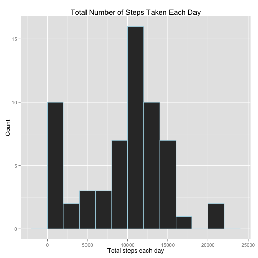
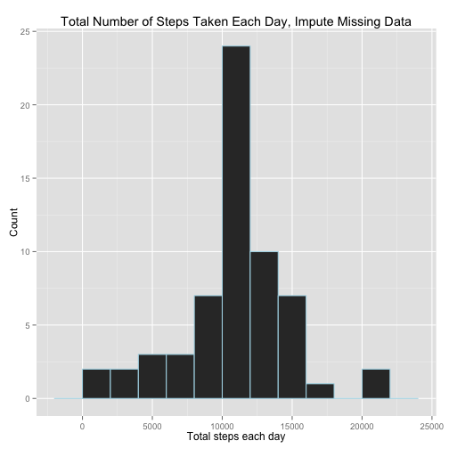
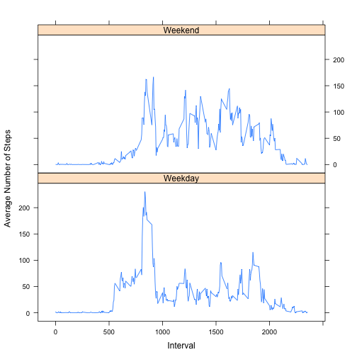

This is a markdown document for the "reproducible research" course assignment 1.
s


**1. Load and preprocess the data**


```r
df1 <- read.csv("activity.csv", header = T, na.string="NA")

#group steps by day
df2 <- df1 %>% group_by(date) %>% summarise(total_steps=sum(steps,na.rm=T))
```

**2. What is mean total number of steps taken per day?**

i. Make a histogram of the total number of steps taken each day


```r
#hist(df3$total_steps, col = "blue", xlab = "Total steps each day", ylab = "Count")
ggplot(df2, aes(x=total_steps)) + geom_histogram(colour = "lightblue", binwidth = 2000) + xlab("Total steps each day") + ylab("Count") + ggtitle("Total Number of Steps Taken Each Day")
```

 

ii. Calculate and report the mean and median total number of steps taken per day


```r
orig.mean.steps <- round(mean(df2$total_steps), 1)
orig.med.steps <- round(median(df2$total_steps), 1)
```

The mean number of steps taken per day = 9354.2. The median number of steps taken per day = 10395.

**3.What is the average daily activity pattern?**

i.Make a time series plot (i.e. type = "l") of the 5-minute interval (x-axis) and the average number of steps taken, averaged across all days (y-axis)


```r
#average number of steps taken across each interval
df3 <- df1 %>% group_by(interval) %>% summarise(avg_steps=mean(steps, na.rm=T))
plot(df3$interval, df3$avg_steps,type = "l", xlab = "Interval", ylab = "Average Number of Steps")
title("Time Series Plot of Average Number of Steps Taken Across Intervals")
```

 

ii. Which 5-minute interval, on average across all the days in the dataset, contains the maximum number of steps?


```r
max_interval <- df3[df3$avg_steps==max(df3$avg_steps, na.rm=T),]
```

The 5-min interval that contains the maximum number of steps = Interval 835

4. Impute missing values

i. Calculate and report the total number of missing values in the dataset (i.e. the total number of rows with NAs)


```r
na.rows <- nrow(df1) - sum(complete.cases(df1))
```

The total number of rows with NAs = 2304

ii. Devise a strategy for imputing missing values:
    Missing values will be imputed as mean value for the given interval

iii. Create a new dataset that is equal to the original dataset but with the missing data filled in.


```r
#calculate mean steps per day
avg.perday <- aggregate(df1$steps, list(interval=df1$interval), mean, na.rm=TRUE)
df4 <- merge(df1, avg.perday, by = "interval") %>% mutate(steps=ifelse(is.na(steps)==0, steps, x))
```

iv. Make a histogram of the total number of steps taken each day and Calculate and report the mean and median total number of steps taken per day. Do these values differ from the estimates from the first part of the assignment? What is the impact of imputing missing data on the estimates of the total daily number of steps?


```r
df5 <- setNames(aggregate(df4$steps, list(date=df4$date), sum), c("date","total_steps"))
ggplot(df5, aes(x=total_steps)) + geom_histogram(colour = "lightblue", binwidth = 2000) + xlab("Total steps each day") + ylab("Count") + ggtitle("Total Number of Steps Taken Each Day, Impute Missing Data")
```

 

```r
imp.mean.steps <- round(mean(df5$total_steps))
imp.med.steps <- round(median(df5$total_steps))
```

The mean steps per day for the original data = 9354.2, the median steps per day for the original data = 10395. The mean steps per day for the imputed data = 
10766, the median steps per day for the imputed data = 10766. Therefore, imputing missing data has increased the mean and median steps per day.

5. Are there differences in activity patterns between weekdays and weekends?

i. Create a new factor variable in the dataset with two levels – “weekday” and “weekend” indicating whether a given date is a weekday or weekend day.


```r
df6 <- df4 %>% mutate(day.type=ifelse(weekdays(as.Date(date)) %in% c("Monday","Tuesday","Wednesday",
                      "Thursday","Friday"), "Weekday", "Weekend"))                                                             
```

ii. Make a panel plot containing a time series plot (i.e. type = "l") of the 5-minute interval (x-axis) and the average number of steps taken, averaged across all weekday days or weekend days (y-axis). 


```r
df7 <- setNames(aggregate(df6$steps, list(day.type=df6$day.type, interval=df6$interval), mean, na.rm=T),
               c("day.type","interval","steps"))
xyplot(steps~interval|day.type, data=df7, type="l", layout=c(1,2), xlab="Interval",
       ylab="Average Number of Steps")
```

 
